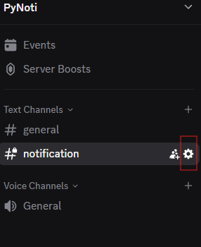
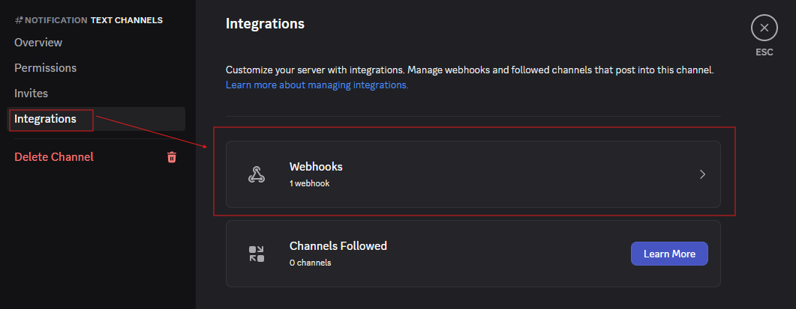
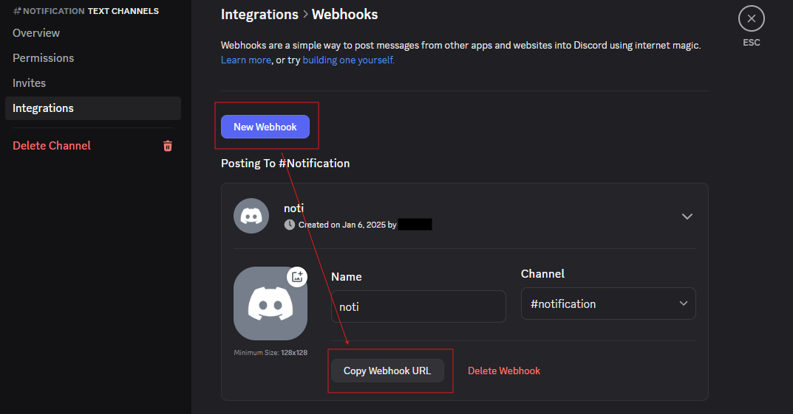

## Setup guide

### Dependencies
* Python 3.12+

For required packages, please see [requirements.txt](requirements.txt). This project was developed and tested using Python's built-in virtual environment module, `venv`.

Additionally, the code requires `python>=3.8`, `pytorch>=1.7` and `torchvision>=0.8`. The installation instructions can be found [here](https://pytorch.org/get-started/locally/).

<a name="download-orthosam"></a>
### Download OrthoSAM:
Use `git clone https://github.com/UP-RS-ESP/OrthoSAM.git` to download the repository (skip this step if you already have done it): 
  ```bash
  git clone https://github.com/UP-RS-ESP/OrthoSAM.git
  cd OrthoSAM
  ```

<a name="installation-with-conda"></a>
### Installation with conda:

1. Install environment:
  ```bash
  conda create -y -n OrthoSAM -c conda-forge python=3.12 pip ipython jupyterlab numpy pandas numba scipy scikit-learn scikit-image matplotlib cupy pytorch torchvision
  conda activate OrthoSAM
  ```

2. Install requirements from github repository: 
  ```bash
  pip install -r requirements.txt && orthosam-setup
  ```

3. Install conda kernel for jupyter lab. Make sure that you are not in the OrthSAM subfolder, because there is a conflict with the `code`` directory:
  ```bash
  cd ~
  python -m ipykernel install --user --name=OrthoSAM
  ```


<a name="installation-with-a-virtual-environment"></a>
### Installation with a virtual environment
1. Create a virtual environment
  ```
  python -m venv venv
  ```


2. Activate the virtual environment

  On macOS/Linux:
  ```
  source venv/bin/activate
  ```
  On Windows:
  ```
  venv\Scripts\activate
  ```

3. To install all required packages and setup OrthoSAM: 
  ```
  pip install -r requirements.txt && orthosam-setup
  ```

<a name="installation-of-orthosam"></a>
### Installation of OrthoSAM (package only)

If all dependencies have already been installed (e.g. via conda or a virtual environment), you can install OrthoSAM directly from the repository root:
    ```
    pip install -e . && orthosam-setup
    ```

`orthosam-setup` performs the following setup tasks after installing OrthoSAM:

1. Create config.json in `OrthoSAM/config.json`  
    - This sets absolute paths for OrthoSAM. For more details on the configuration file, see the [Configuration file](#configuration_file) section below.


2. Create required directories  
   - `OrthoSAM/MetaSAM/` for storing model checkpoints.
   - `data/` and `output/` for inputs and outputs.

3. Download default SAM model checkpoints  
   - `sam_vit_h_4b8939.pth`  
   - `sam_vit_l_0b3195.pth`  
   - `sam_vit_b_01ec64.pth`

Note: This command must be run from the **repository root directory**.  

<a name="installation-verification"></a>
### Installation Verification
To verified your installation:
  ```
  python -c "import OrthoSAM; print('OK')"
  ```

<a name="configuration_file"></a>
### Configuration file:
[`config.json`](OrthoSAM/config.json) can be used to specify directory paths. This is also the file to specify which checkpoint to use. If you wish set any default parameter, it can be added to `config.json`. Please note that parameters defined in the script has the priority.


<a name="discord-notification"></a>
### Discord notification:
As processing time can be long when dealing with large images, we have added a notification function using Discord Webhook. In order to enable this function, set 'Discord_notification' to True in the parameters or the configuration file. 

Please follow these steps to setup Discord notification. 

1. Go to the Discord channel where you would like the notification be sent to. Click **Edit Channel**.



2. Go to **Integrations**, **Webhooks**.



3. If you do not already have a Webhook, click **New Webhook** and then **Copy Webhook URL**. 



4. Create **DWH.txt** in the OrthoSAM/OrthoSAM directory to store your Webhook URL.
```bash
echo "your_webhook_url_here" > OrthoSAM/DWH.txt
```