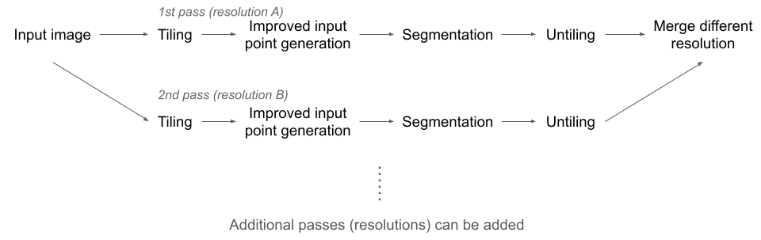
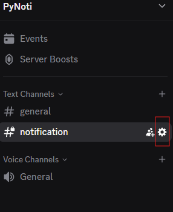
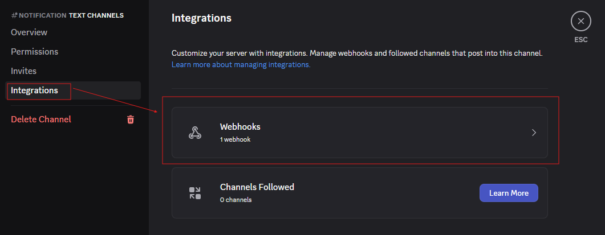
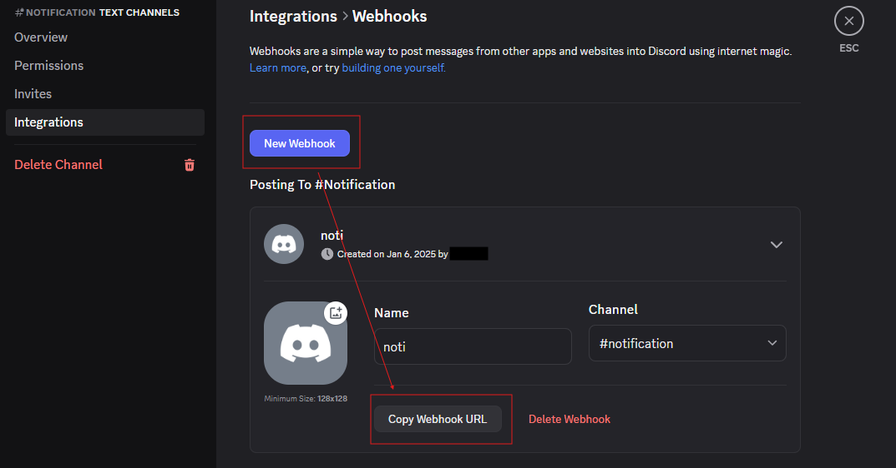

# OrthoSAM: Multi-Scale Extension of SegmentAnything for River Pebble Delineation from Large Orthophotos

*This work is currently under review. Please cite as:
Chan, V., Rheinwalt, A., Bookhagen, B.: OrthoSAM: Multi-Scale Extension of SegmentAnything for River Pebble Delineation from Large Orthophotos, in review* [PDF](OrthoSAM_inreview.pdf)

*The three example orthomosaics from the Ravi river in the western Himalaya described in the manuscript and used as examples in this repository are available on Zenodo https://doi.org/10.5281/zenodo.16567549*

Sediment characteristics and grain-size distribution are crucial for understanding natural hazards, hydrologic conditions, and ecosystems. Traditional methods for collecting this information are costly, labor-intensive, and time-consuming. To address this, we present **OrthoSAM**, a workflow leveraging the Segment Anything Model (SAM) for automated delineation of densely packed pebbles in high-resolution orthomosaics.

Our framework consists of a tiling scheme, improved input (seed) point generation, and a multi-scale resampling scheme. Validation using synthetic images shows high precision close to 1, a recall above 0.9, with a mean IoU above 0.9. Using a large synthetic dataset, we show that the two-sample Kolmogorov-Smirnov test confirms the accuracy of the grain size distribution. We identified a size detection limit of 30 pixels in diameter that corresponds to 700 pixels for a circular object. Applying OrthoSAM to orthomosaics from the Ravi River in India, we delineated 6087 pebbles with high precision and recall. The resulting grain dataset includes measurements such as area, axis lengths, perimeter, RGB statistics, and smoothness, providing valuable insights for further analysis in geomorphology and ecosystem studies.

**Workflow**


#### Table of content
1. [Setup Guide](#setup-guide)
    - [Installation with conda](#installation-with-conda)
    - [Installation with a virtual environment](#installation-with-a-virtual-environment)
    - [Installing Discord notifications](#discord-notification)
2. [Code and Examples](#Code-examples)
    - Several example Jupyter Notebooks to process individual images or large orthomosaics either locally on your desktop system or on Google Colab. We also provide several videos that will guide you through the processing steps.

<a name="setup-guide"/>

## Setup guide

### Dependencies
* Python 3.11+

For required packages, please see [requirements.txt](requirements.txt). This project was developed and tested using Python's built-in virtual environment module, `venv`.

Additionally, the code requires `python>=3.8`, `pytorch>=1.7` and `torchvision>=0.8`. The installation instructions can be found [here](https://pytorch.org/get-started/locally/).

<a name="installation-with-conda"></a>
### Installation with conda:

1. Install environment:
  ```bash
  conda create -y -n OrthoSAM -c conda-forge python=3.11 pip ipython jupyterlab numpy pandas numba scipy scikit-learn scikit-image matplotlib cupy pytorch torchvision
  conda activate OrthoSAM
  ```

2. Install requirements from github repository. Use `git clone https://github.com/UP-RS-ESP/OrthoSAM.git` to download the repository (skip this step if you already have done it): 
  ```bash
  git clone https://github.com/UP-RS-ESP/OrthoSAM.git
  cd OrthoSAM
  pip install -r requirements.txt
  ```

3. Install conda kernel for jupyter lab. Make sure that you are not in the OrthSAM subfolder, because there is a conflict with the `code`` directory:
  ```bash
  cd ~
  python -m ipykernel install --user --name=OrthoSAM
  ```

4. Create a subdirectory for storing model checkpoints and download SAM checkpoints. This can be located anywhere, but the default is to have it in `OrthoSAM`. If there is a new SAM model available, it will appear on https://github.com/facebookresearch/segment-anything. You are likely only going to need the first, high-resolution model (sam_vit_h_*.pth):
  ```bash
  cd OrthoSAM
  mkdir MetaSAM
  cd MetaSAM
  wget https://dl.fbaipublicfiles.com/segment_anything/sam_vit_h_4b8939.pth
  wget https://dl.fbaipublicfiles.com/segment_anything/sam_vit_l_0b3195.pth
  wget https://dl.fbaipublicfiles.com/segment_anything/sam_vit_b_01ec64.pth
  ```

5. Update configuration path. Please update the data directory and checkpoint directory path in [`config.json`](code/config.json). If you keep your MetaSAM within the OrthSAM github directory where `code` is also stored, you can use: 
  ```bash
  cd OrthoSAM
  python update_config.py
  ```
  In the file [`config.json`](code/config.json) you also specify the MetaSAM checkpoint. If you wish set any default parameter, it can be added to `config.json`. Please note that parameters defined in the script have the priority.


<a name="installation-with-a-virtual-environment"></a>
### Installation with a virtual environment
1. Create a virtual environment
  ```
  python -m venv venv
  ```


2. Activate the virtual environment

  On macOS/Linux:
  ```
  source venv/bin/activate
  ```
  On Windows:
  ```
  venv\Scripts\activate
  ```

3. To install all required packages: 
  ```
  pip install -r requirements.txt
  ```

4. Create a subdirectory for storing model checkpoints
  ```bash
  mkdir -p MetaSAM
  ```

5. Download the Segment Anything checkpoint from 

  `vit_h`:
  https://dl.fbaipublicfiles.com/segment_anything/sam_vit_h_4b8939.pth

  `vit_l`:
  https://dl.fbaipublicfiles.com/segment_anything/sam_vit_l_0b3195.pth

  `vit_b`:
  https://dl.fbaipublicfiles.com/segment_anything/sam_vit_b_01ec64.pth

  Download all three:
  ```bash
  wget https://dl.fbaipublicfiles.com/segment_anything/sam_vit_h_4b8939.pth
  wget https://dl.fbaipublicfiles.com/segment_anything/sam_vit_l_0b3195.pth
  wget https://dl.fbaipublicfiles.com/segment_anything/sam_vit_b_01ec64.pth
  ```

6. Move the downloaded checkpoint into the MetaSAM folder.

7. Update configuration path. Please update the data directory and checkpoint directory path in [`config.json`](code/config.json). This can be done automatically with [`update_config.py`](code/update_config.py). 
    - This is also the file to specify which checkpoint to use. If you wish set any default parameter, it can be added to `config.json`. Please note that parameters defined in the script has the priority.
    - This script will also create the data and output directory if they do not exist.
  ```
  python update_config.py
  ```

<a name="discord-notification"></a>
### Discord notification:
As processing time can be long when dealing with large images, we have added a notification function using Discord Webhook. In order to enable this function, set 'Discord_notification' to True in the parameters or the configuration file. 

Please follow these steps to setup Discord notification. 

1. Go to the Discord channel where you would like the notification be sent to. Click **Edit Channel**.



2. Go to **Integrations**, **Webhooks**.



3. If you do not already have a Webhook, click **New Webhook** and then **Copy Webhook URL**. 



4. Create **DWH.txt** in the OrthoSAM/code directory to store your Webhook URL.
```bash
echo "your_webhook_url_here" > code/DWH.txt
```


<a name="Code-examples"></a>
## Code
### Examples
To use the Ravi River orthomosaics from the western Himalaya presented in our manuscript, download data from https://doi.org/10.5281/zenodo.16567549 or use your own data. 

- [`OrthoSAM_Notebook_Ravi_crop_local.ipynb`](code/OrthoSAM_Notebook_Ravi_crop_local.ipynb): Example walk through for processing a cropped version from the Ravi River orthomosaic (processing time: a few minutes) [YouTube Video]()
- [`OrthoSAM_Notebook_Sedinet_local.ipynb`](code/OrthoSAM_Notebook_Sedinet_local.ipynb): Example walk through for processing a single image from the SediNet library.
- [`OrthoSAM_Notebook_Sedinet_Colab.ipynb`](code/OrthoSAM_Notebook_Sedinet_Colab.ipynb): Example walk through using Google Colab for processing. Note that the Google Colab version without additional computational resources will not be able to process large images. [YouTube Video]() 
- [`OrthoSAM_Notebook_imagegrains_local.ipynb`](code/OrthoSAM_Notebook_imagegrains_local.ipynb): Example to process an image from the imagegrains library (processing time: a few minutes)
- [`Example_generate_synthetic_pebble_images.ipynb`](code/synthetic/Example_generate_synthetic_pebble_images.ipynb): Example of the pebble image generator with shadows to create large training datasets. [YouTube Video]() 
- [`OrthoSAM_notebook.ipynb`](code/OrthoSAM_notebook.ipynb): General instruction of how to create parameters and run OrthoSAM (select a single image).
- [`OrthoSAM_presets.ipynb`](code/OrthoSAM_presets.ipynb): Examples of using OrthoSAM with predefined parameters for large orthomosaics and for compact fine objects. When using predefined parameters, only output directory, input path and resolution are required.
- [`OrthoSAM_with_create_para.py`](code/OrthoSAM_with_create_para.py): Script to create parameters and run OrthoSAM.
- [`generate_synthetic_images.ipynb`](code/synthetic/generate_synthetic_images.ipynb): General instruction of how to generate synthetic pebble images.

### OrthoSAM
- [`OrthoSAM.py`](code/OrthoSAM.py): Contains the main function to run OrthoSAM, and functions with predefined parameters for large orthomosaics and compact fine objects (see OrthoSAM_presets.ipynb).
- [`synthetic_generator.ipynb`](code/synthetic/synthetic_generator.ipynb): Contains the function to generate synthetic pebble images.

### Utilities
- [`para_helper.ipynb`](code/para_helper.ipynb): Parameter assistance.
- [`update_config.py`](code/update_config.py): Update data directory and checkpoint directory path.
- [`utility.py`](code/utility.py): Utility functions.

### Other
- [`config.json`](code/config.json): Configuration file to define model type, checkpoint directory, data directory, output directory, and any default parameters.
- [`DWH.txt`](code/DWH.txt): File to store your Discord webhook URL.
<!-- `OrthoSAM`: [OrthoSAM codes.](code/OrthoSAM.py)-->


## Segment-Anything

We have developed our framework based on the Meta AI Segment-Anything model. For more details regarding the model please visit their Github:
https://github.com/facebookresearch/segment-anything
